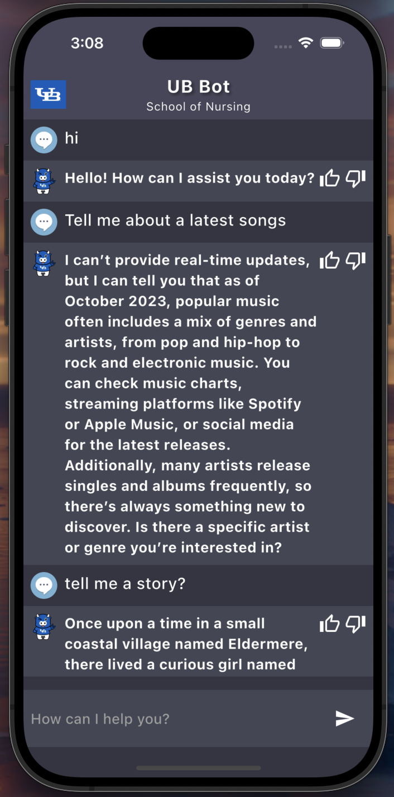
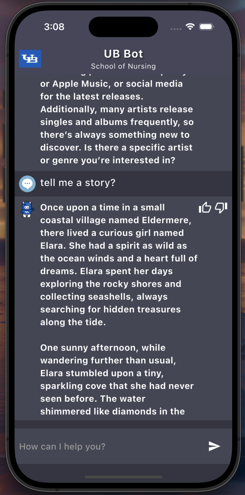
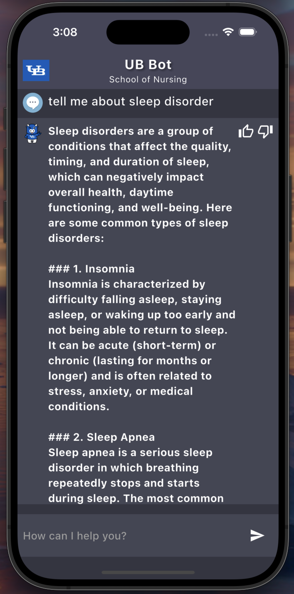
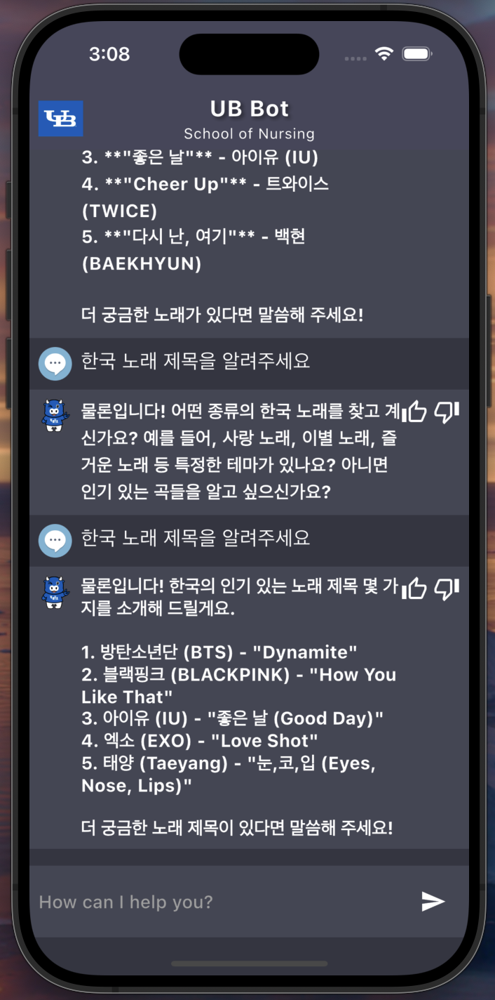

# Chatbot Mobile

A new Flutter project for a chatbot application that utilizes the OpenAI API to generate responses.

## Getting Started

This project is a starting point for a Flutter application.

### Features
- **Natural Language Processing**: The chatbot uses OpenAI's API for understanding and generating human-like responses.

- **User-Friendly Interface**: Intuitive design for easy interaction with the chatbot.

- **Responsive Design**: The app is optimized for both mobile and web platforms.

- **Conversation History**: Users can view past interactions for context.

- **Multi-Language Support**: The chatbot can respond in multiple languages, allowing users from different linguistic backgrounds to interact seamlessly.

### Multi-Language Support
The chatbot is designed to support various languages, enabling users to communicate in their preferred language. Currently, examples:
- English
- Spanish
- French
- Hindi
- Korean
- Chinese
and many more!

### Technologies Used
- **Flutter**: For building the UI.
- **Dart**: The programming language used for development.
- **OpenAI API**: For generating responses based on user input.
